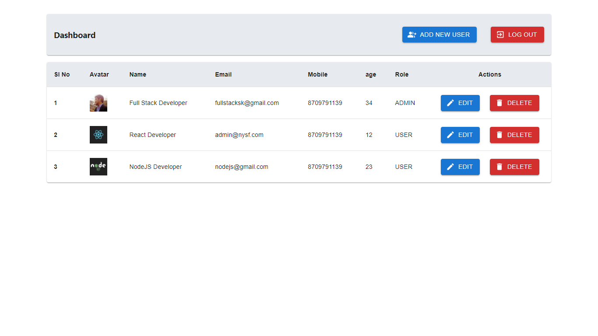

# node-react-assignment

```
Practical Task :

1) Backend/API in Node JS
2) Front End in REACT JS (Use redux wherever you can)

   -Login
    There are two types of login :

    1) Administrator :

TAB 1  : List Data

i) All data saved in the database will be shown here with Edit, Delete option.
ii) When user clicks delete data will be deleted and when clicks on edit popup will open which will enable user to edit and update the data and then
     save it in the database.

    2) User

      TAB 1  : Add Entry

i) Normal User log in, they can see entry form with below fields :
  - Name
- Age
- Mobile
- Email
- Photo (File Upload)
- Submit

ii) Once user clicks submit button these data will be saved in the database with image upload.

Note : Form validation should be there with appropriate error messages.
```

# first start node server

> go to /api

> npm install || yarn install

> npm run start || yarn start

# Then start react app

> go to /frontend

> npm install || yarn install

> npm run start || yarn start

> Visit [`http://localhost:3000`](http://localhost:3000)

# Dashboard View


